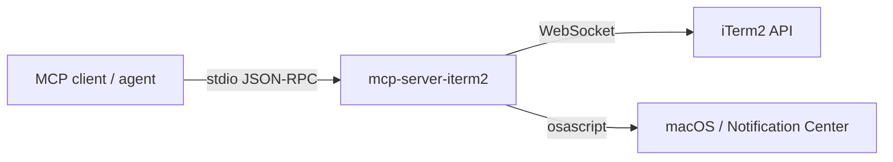
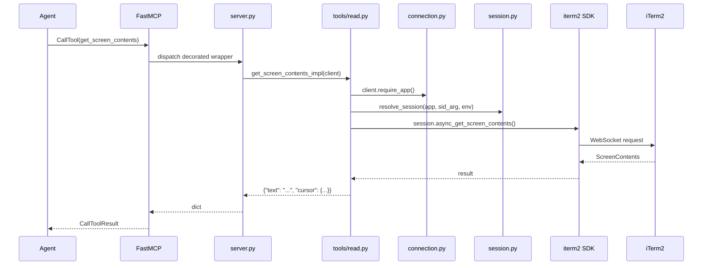

# Architecture

`mcp-server-iterm2` is a stdio MCP server that exposes iTerm2 to AI agents for **observation** and **non-destructive annotation**. This document describes how the pieces fit together. For setup and tool reference see [README.md](README.md); for the security model see [SECURITY.md](SECURITY.md).

## Process model

A single Python process, single asyncio event loop. The MCP client (an agent or IDE plugin) spawns this server as a subprocess and communicates over stdin/stdout using JSON-RPC. The server in turn maintains one persistent WebSocket connection to iTerm2 (`ws://localhost:1912`) using the official `iterm2` Python SDK.



There is no HTTP listener, no port owned by the server, no on-disk state. Inputs come only from the MCP client; outputs go only to the client and to iTerm2.

## Startup sequence

1. `main()` (`server.py`) creates an `ITermClient` and launches `run_reconnect_loop()` as a background task.
2. The reconnect loop calls `connect_once()`, which:
   - Runs `request_cookie()` (in a worker thread via `asyncio.to_thread`) — shells out to `/usr/bin/osascript` with `tell application "iTerm2" to request cookie`. On first run iTerm2 prompts the user to authorize the script; subsequent macOS Automation grants make this silent.
   - Sets `ITERM2_COOKIE` in the process environment.
   - Calls `iterm2.Connection.async_create()` and `iterm2.async_get_app()`.
   - Installs a disconnect watcher on the SDK's internal dispatch task so we notice WebSocket closures without polling.
3. `main()` waits up to 5 seconds for the first connection to land so startup errors surface synchronously, then enters `mcp.run_stdio_async()`.
4. The reconnect loop runs for the life of the process, re-running `connect_once()` with exponential backoff (1s → 2s → 4s → … → 30s cap) whenever the connection drops.

## Module layout

```
src/mcp_server_iterm2/
  __init__.py          # package version
  py.typed             # PEP 561 marker
  errors.py            # MCPIterm2Error hierarchy + to_error_text
  cookie.py            # AppleScript cookie acquisition (sync subprocess)
  connection.py        # ITermClient, reconnect loop, disconnect watcher
  session.py           # resolve_session + ITERM_SESSION_ID normalization
  output_cursor.py     # opaque cursor encode/decode + diff_since
  server.py            # FastMCP server, tool registration, error wrapping
  tools/
    read.py            # 8 read-only tools
    write.py           # 5 non-destructive write tools
```

Module boundaries are deliberately tight:
- `connection.py` knows the iTerm2 SDK but not MCP.
- `server.py` knows MCP but not the SDK.
- `tools/*.py` translate MCP arguments → SDK calls → MCP responses, nothing more.
- `errors.py` is the only place that names user-facing error strings.

## Data flow: a typical tool call



Every session-targeted tool resolves its target the same way: explicit `session_id` argument first, then `$ITERM_SESSION_ID` (with the `wXtYpZ:` position prefix stripped — iTerm2 sets it but `get_session_by_id` wants the bare UUID). If neither yields a live session, the tool raises `NoCurrentSession` or `SessionNotFound`.

## Error envelope

Tools never propagate raw third-party exceptions to the agent. Every `@mcp.tool()` wrapper in `server.py` catches `Exception` and routes through `_to_tool_error`:

| Inner exception | Agent sees |
|---|---|
| `MCPIterm2Error` (any subclass) | `to_error_text(exc)` — actionable message, e.g. `"iTerm2 unavailable, reconnecting."` |
| Anything else | `"Internal error: <ExceptionClass>"` — the original message is logged server-side but not exposed |

Validation errors (length bounds, RGB range, `user.` prefix violations, malformed cursors) raise `InvalidArgument(MCPIterm2Error)` carrying the actionable message verbatim. Subprocess timeouts raise `SubprocessTimeout`. Connection drops raise `Disconnected`, which becomes the recognizable `"iTerm2 unavailable, reconnecting."` envelope.

## Cursor-based pagination

`get_recent_output` returns `{text, cursor, cursor_expired}`. The cursor is an opaque base64-encoded JSON object `{sid, line}`. Internally:

- First call with `cursor=None` returns the visible-screen contents and a cursor pointing at the last seen line.
- Subsequent calls with the previous cursor return only new output.
- If the iTerm2 buffer has rolled past the cursor (the line is now below `overflow`), the response sets `cursor_expired: true` so the agent knows lines were missed.
- A negative line number (from an empty session's first call) is treated as a fresh start, not expired.

The cursor is bounded to 16 KB; the decoded line number is bounded to int32. The encoded payload is validated end-to-end before any work is done.

## Transaction wrapping

`session.async_get_line_info()` and `session.async_get_contents()` must run inside an `iterm2.Transaction` per the SDK contract — otherwise the buffer can advance between the two RPCs, returning fewer lines than asked with no signal. Both `get_scrollback_impl` and `get_recent_output_impl` wrap the pair in `async with iterm2.Transaction(conn):`.

## Subprocess hygiene

Two places shell out: `cookie.py` (cookie acquisition) and `tools/write.py` (notification posting). Both:

- Use the absolute path `/usr/bin/osascript` (no PATH lookup).
- Pass an explicit minimal `env={"PATH": ..., "HOME": ...}` so `ITERM2_COOKIE` does not propagate to children.
- Set a timeout (30s for cookie, 5s for notification); `subprocess.TimeoutExpired` is converted to `SubprocessTimeout`.
- Run inside `await asyncio.to_thread(...)` so they never block the event loop.

The notification path additionally escapes its title/body for AppleScript string literals (`\` → `\\`, `"` → `\"`, control characters → escape sequences) and bounds title and body lengths before constructing the script.

## What is intentionally not exposed

The tool surface is the security boundary. These iTerm2 capabilities exist in the SDK but are deliberately not wired up:

- `send_text` / keystroke injection
- `close_session` / `close_tab` / `close_window`
- `split_pane` / `new_tab` / `new_window`
- `broadcast_input`
- `select_tab` / focus changes
- Writes to non-`user.*` variables, profile changes beyond tab color, global preferences

Adding any of these would change the security posture; see [SECURITY.md](SECURITY.md) for the trust model.

## Testing strategy

Three tiers:

- **Unit** (`tests/unit/`, default `pytest`): mocks the `iterm2` SDK at the module boundary. Covers session resolution, cursor encoding, error rendering, tool argument validation, reconnect backoff, and connection-failure → error-envelope translation. An autouse fixture stubs `iterm2.Transaction` as a no-op async context manager so individual tests don't need to mock it.
- **Integration** (`tests/integration/`, opt-in via `pytest -m integration`): exercises every tool against a live iTerm2 from inside an iTerm2 session.
- **Smoke** (`scripts/smoke.py`): manual end-to-end run of all 13 tools, prints pass/fail summary. Used before tagging a release.

Unit tests run in CI on macOS for Python 3.12 and 3.13. Integration tests are not run in CI (they require iTerm2 and would mutate the developer's session).
